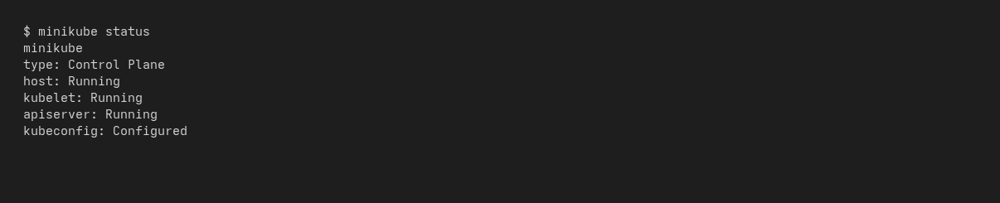
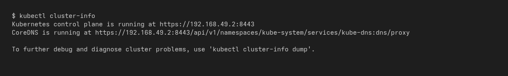
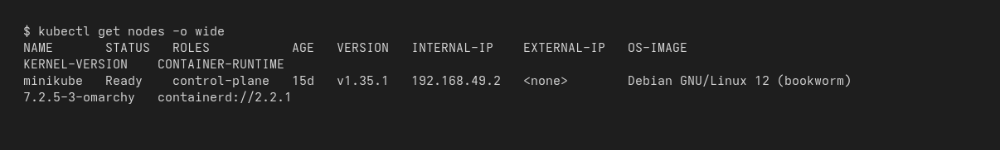
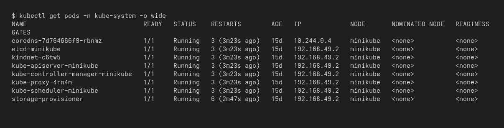
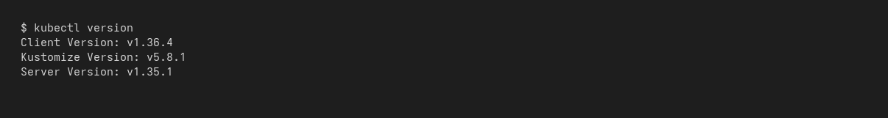
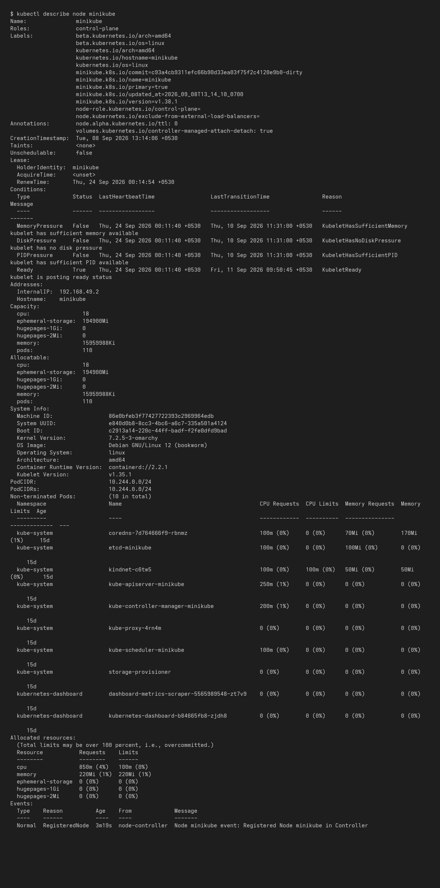

# Kubernetes Fundamentals — Screenshots

## Minikube status

## Cluster info

## Nodes

## Control plane / system pods

## Client & server versions

## Node details (kubelet, kube-proxy, container runtime, capacity)

