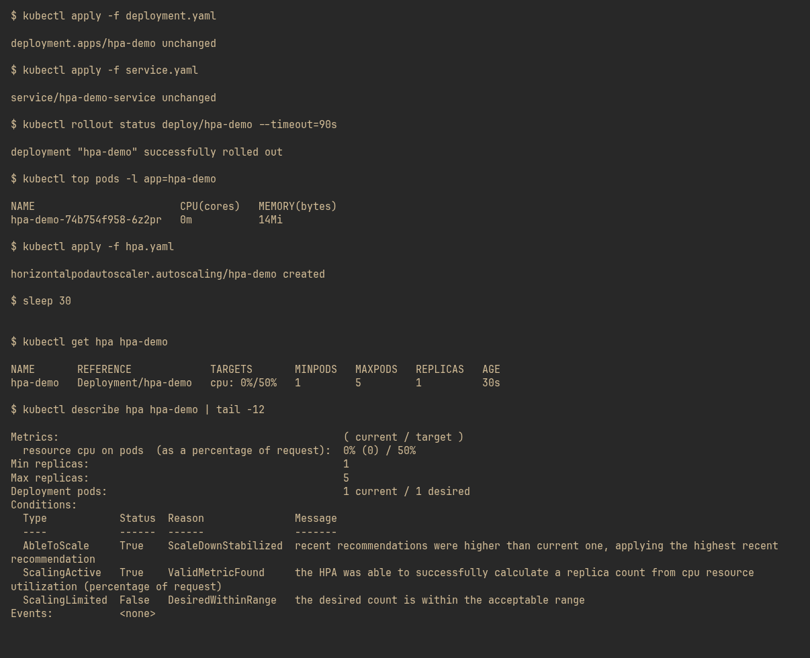
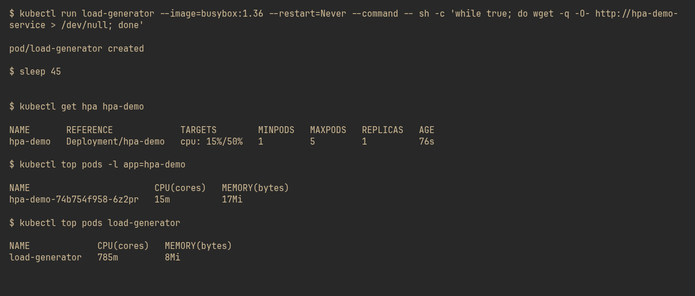
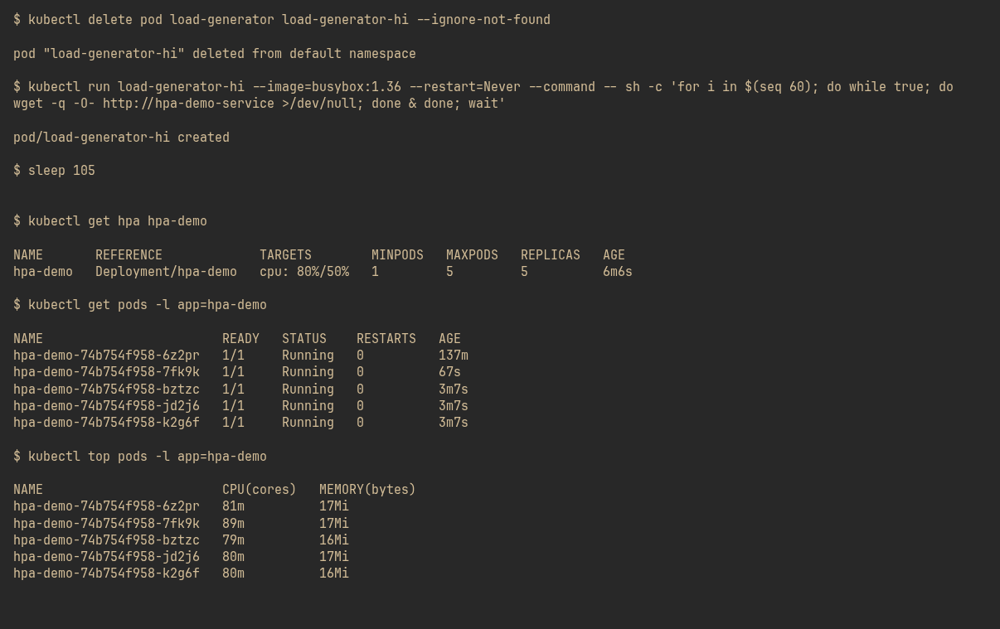
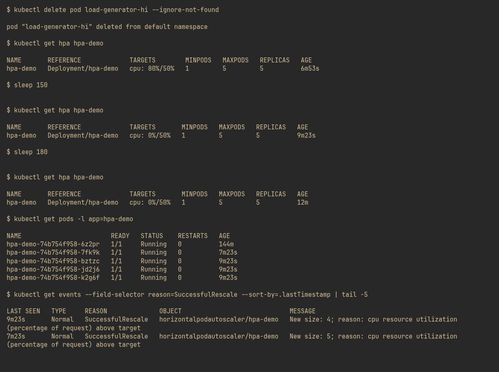

## Screenshots

### 1. HPA created — conditions all True

### 2. Low load — 15%, below 50% target, 1 replica

### 3. High load — 191%, scaled to 4 Pods

### 4. Load removed — scale-in to 1 after stabilization

