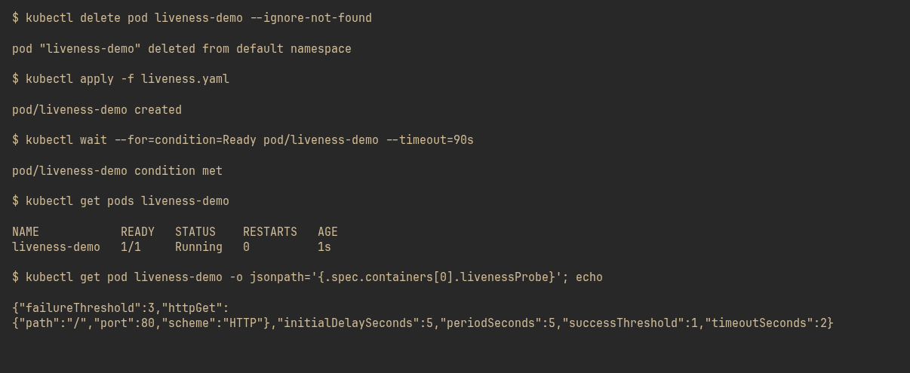
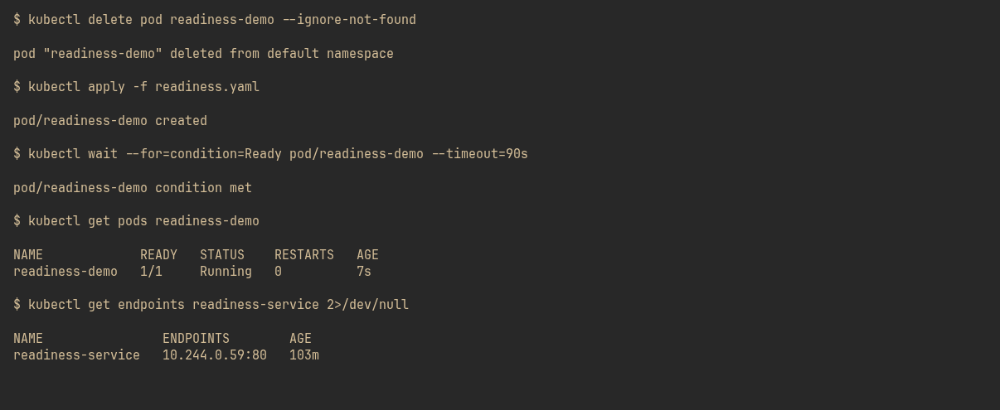
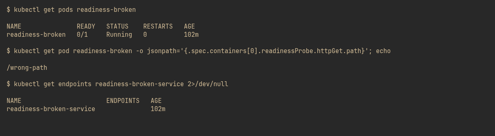
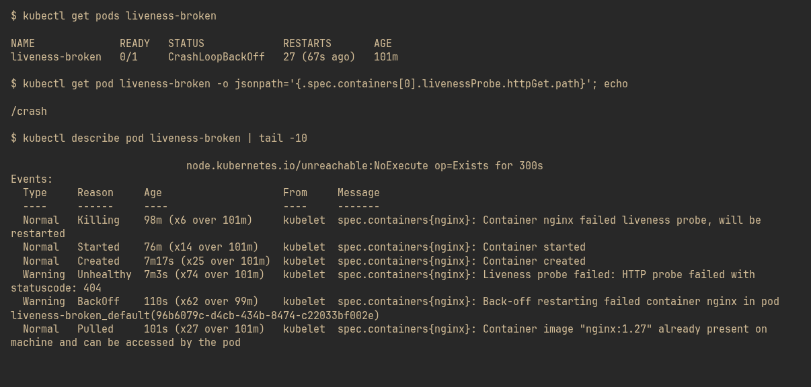
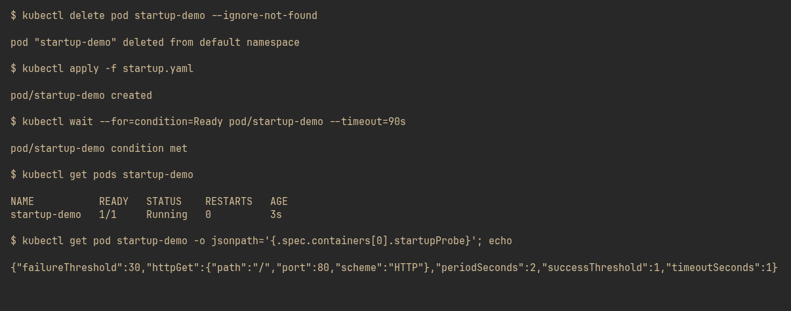

## Screenshots

### 1. Liveness probe — healthy pod, 0 restarts

### 2. Readiness probe — healthy pod, endpoints populated

### 3. Readiness probe failing — 0/1 Running, 0 restarts, empty endpoints

### 4. Liveness probe failing — CrashLoopBackOff, restarts climbing, 404 events

### 5. Startup probe — all three probes configured on one pod

