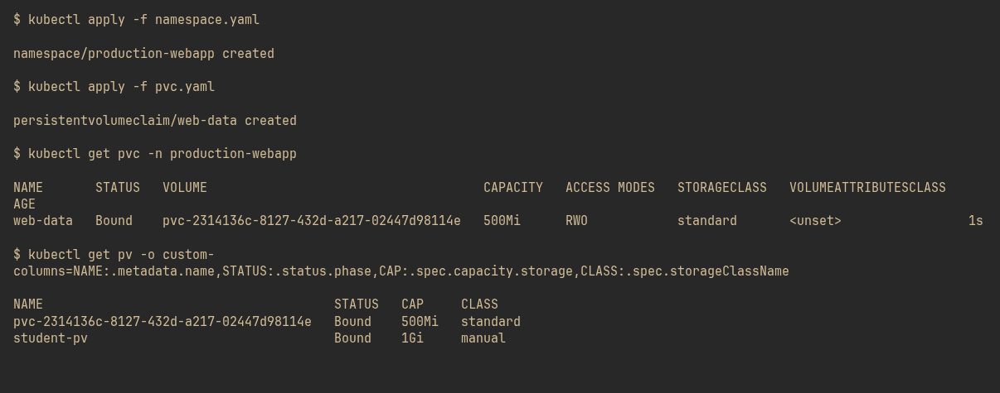
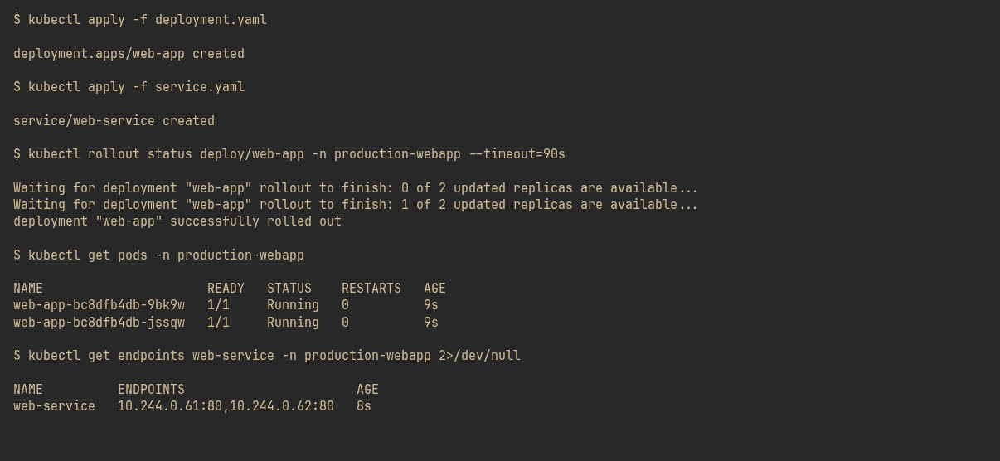
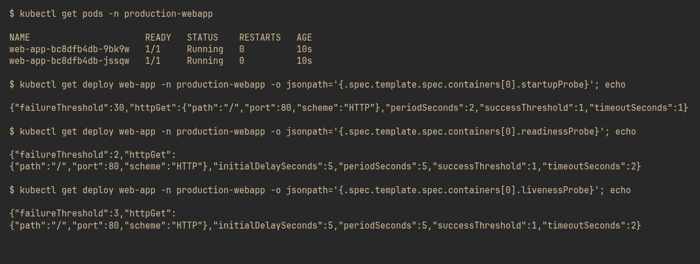
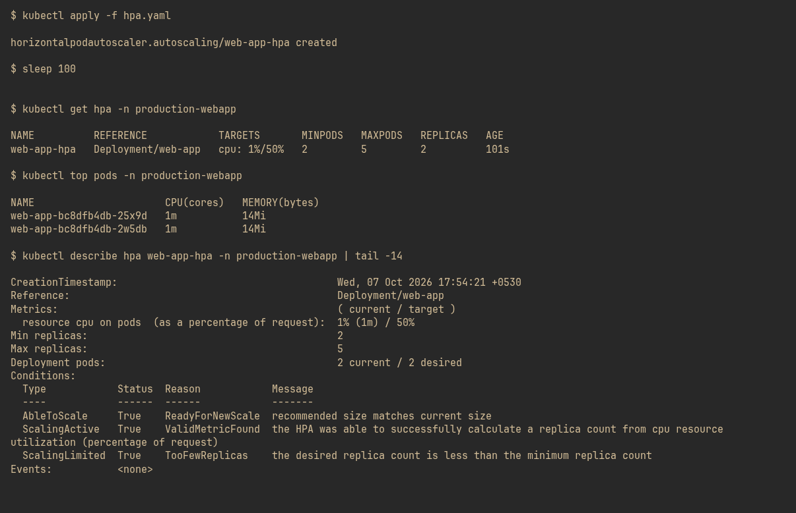
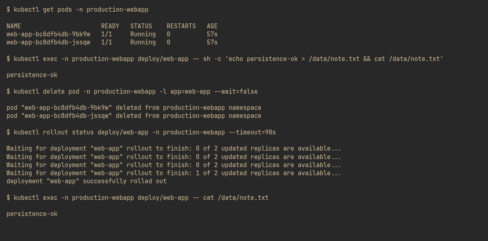

## Screenshots

### 1. Namespace + PVC bound to a PV

### 2. Deployment + Service — 2 ready Pods, endpoints populated

### 3. All three probes configured on the Deployment

### 4. HPA metrics live — conditions all True

### 5. Data survives pod deletion — PVC persists

