# Session 14: Kubernetes Troubleshooting

## Screenshots

### Task 1 — Troubleshooting commands

#### 1. kubectl get (default, -o wide, custom-columns)

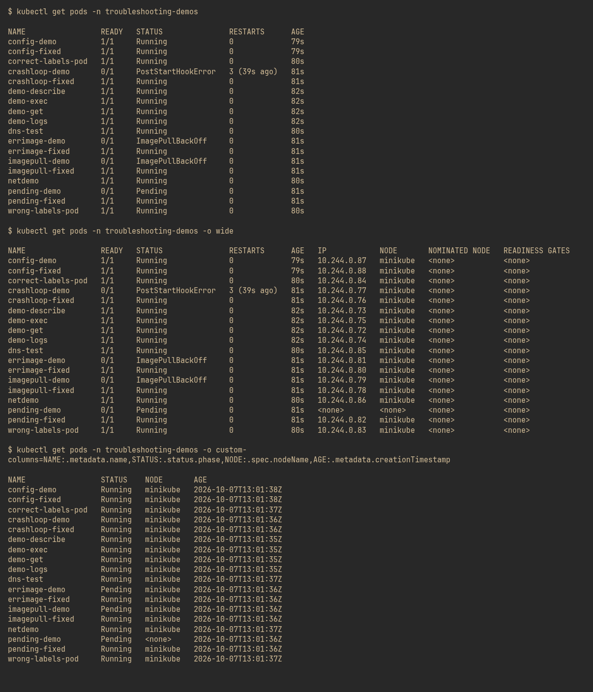

#### 2. kubectl describe

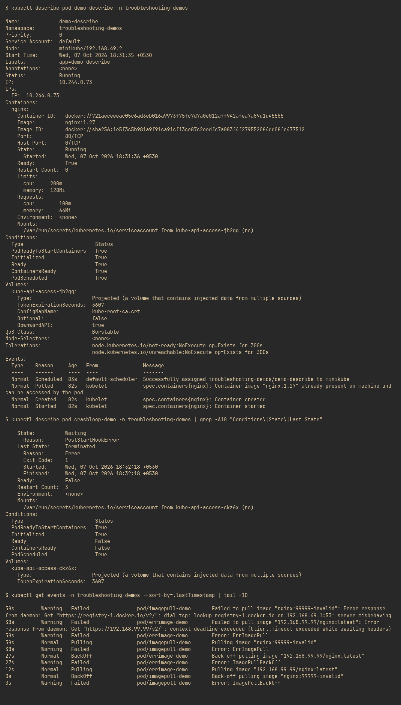

#### 3. kubectl logs

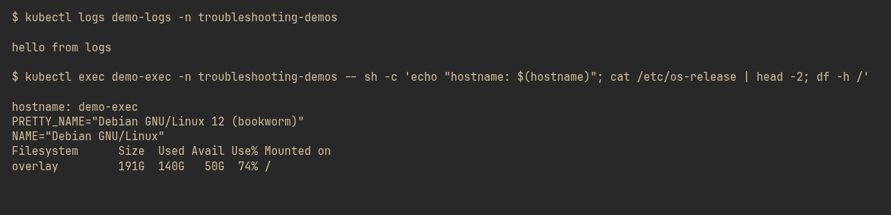

#### 4. kubectl exec

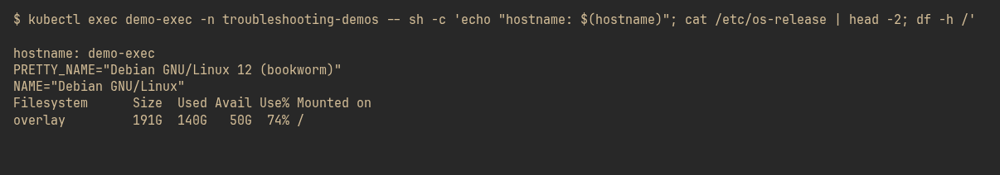

#### 5. kubectl events + explain + top

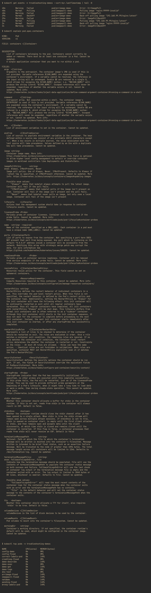

### Task 2 — Common issues

#### 1. CrashLoopBackOff — broken

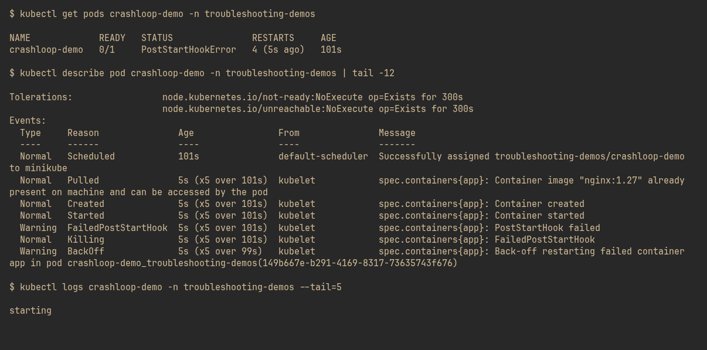

#### 2. CrashLoopBackOff — fixed

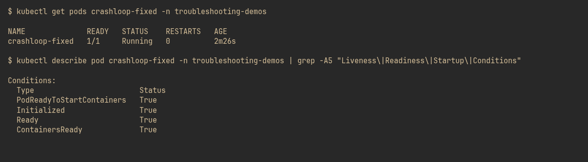

#### 3. ImagePullBackOff — broken

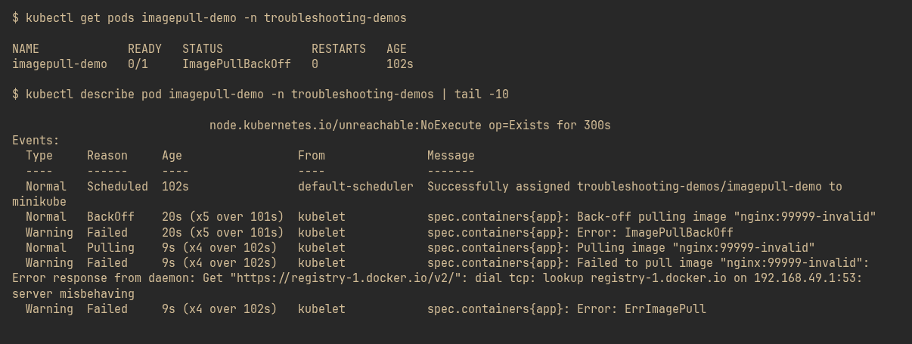

#### 4. ImagePullBackOff — fixed

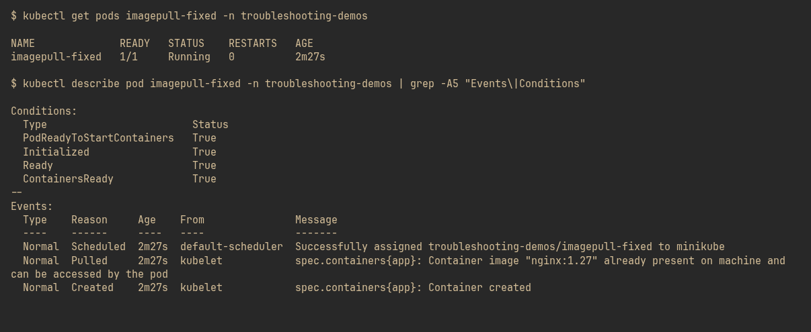

#### 5. ErrImagePull — broken

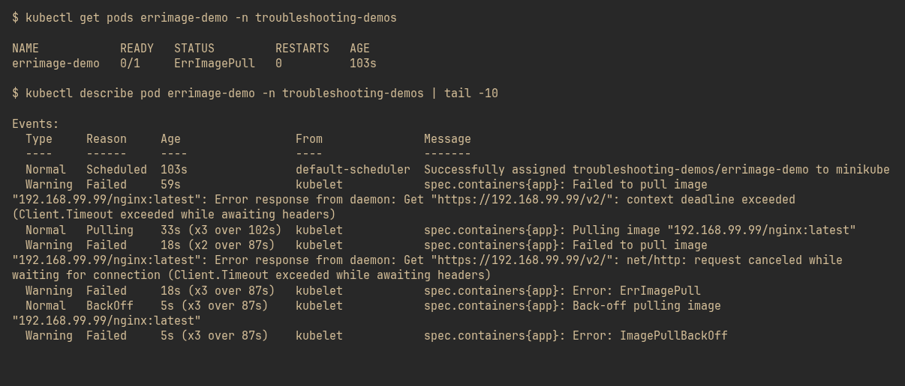

#### 6. ErrImagePull — fixed

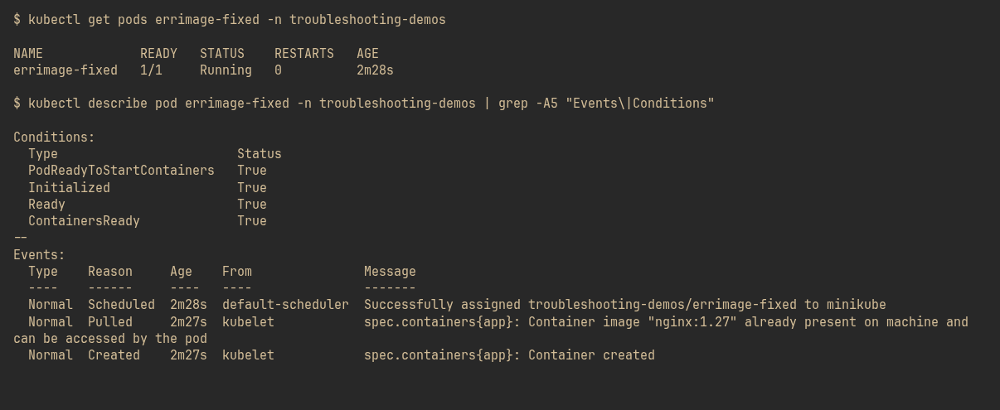

#### 7. Pending (unsatisfiable requests) — broken

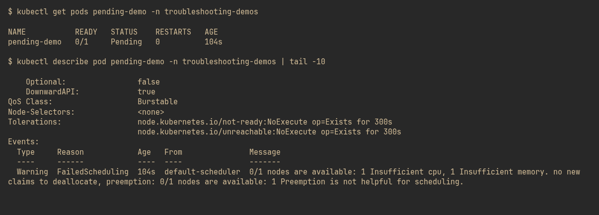

#### 8. Pending — fixed

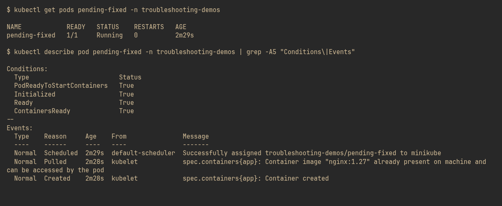

#### 9. Service selector mismatch — broken

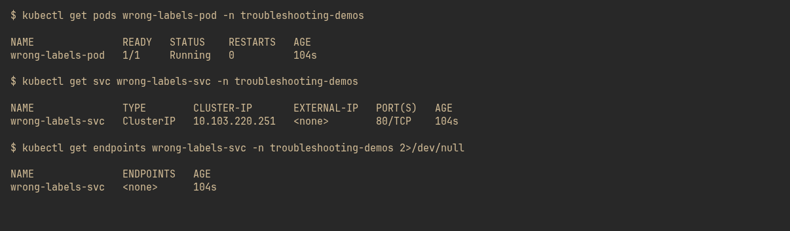

#### 10. Service selector mismatch — fixed

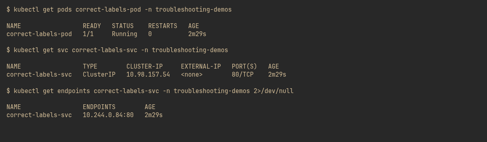

#### 11. DNS resolution test

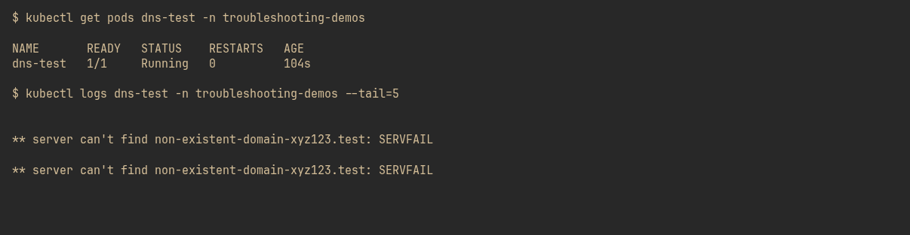

#### 12. DNS resolution verified

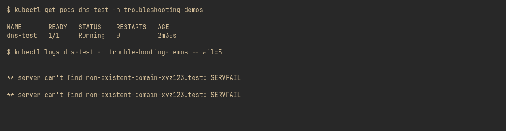

#### 13. Pod networking (NetworkPolicy) — fixed

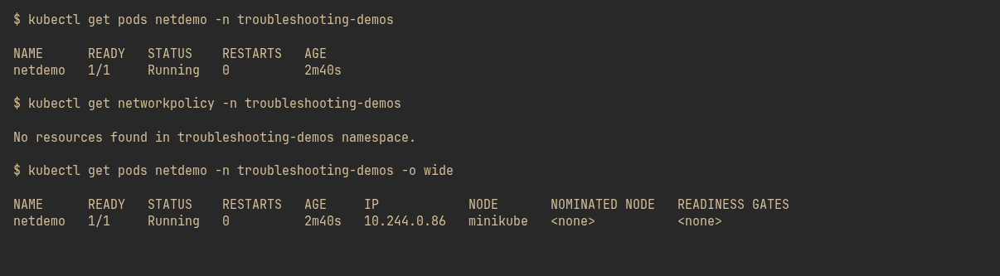

#### 14. ConfigMap configuration — fixed

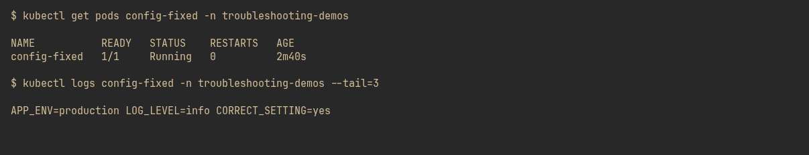

### Task 3 — Mini project

#### 1. Broken deployment deployed (liveness path + selector faults)

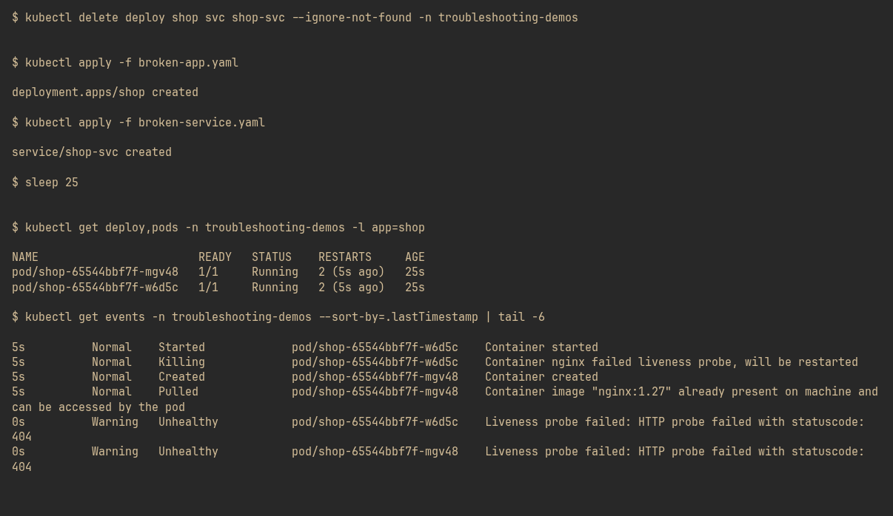

#### 2. Root cause identified

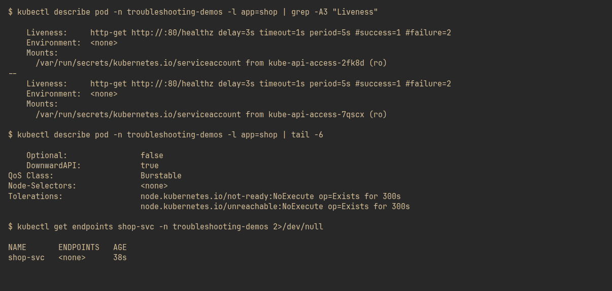

#### 3. Fixed — endpoints healthy

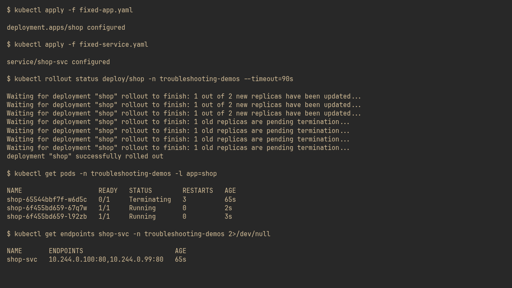
