# Session 15: Helm

## Screenshots

### Task 1 — Helm commands

#### 1. helm create

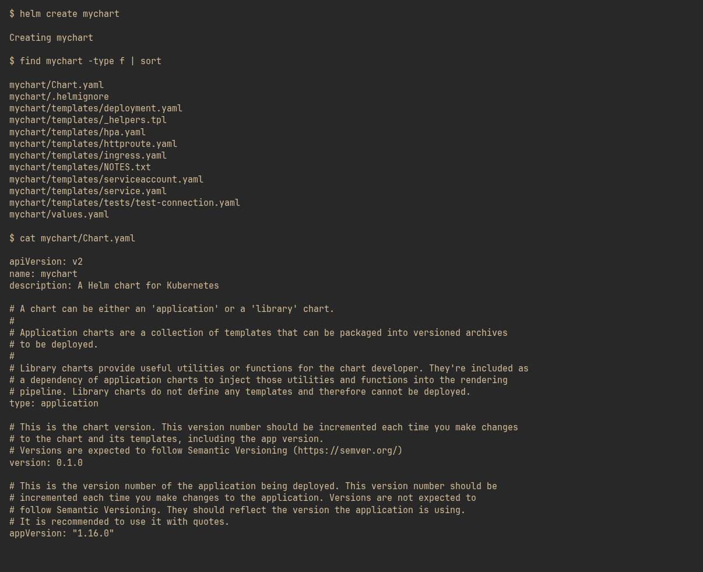

#### 2. helm install

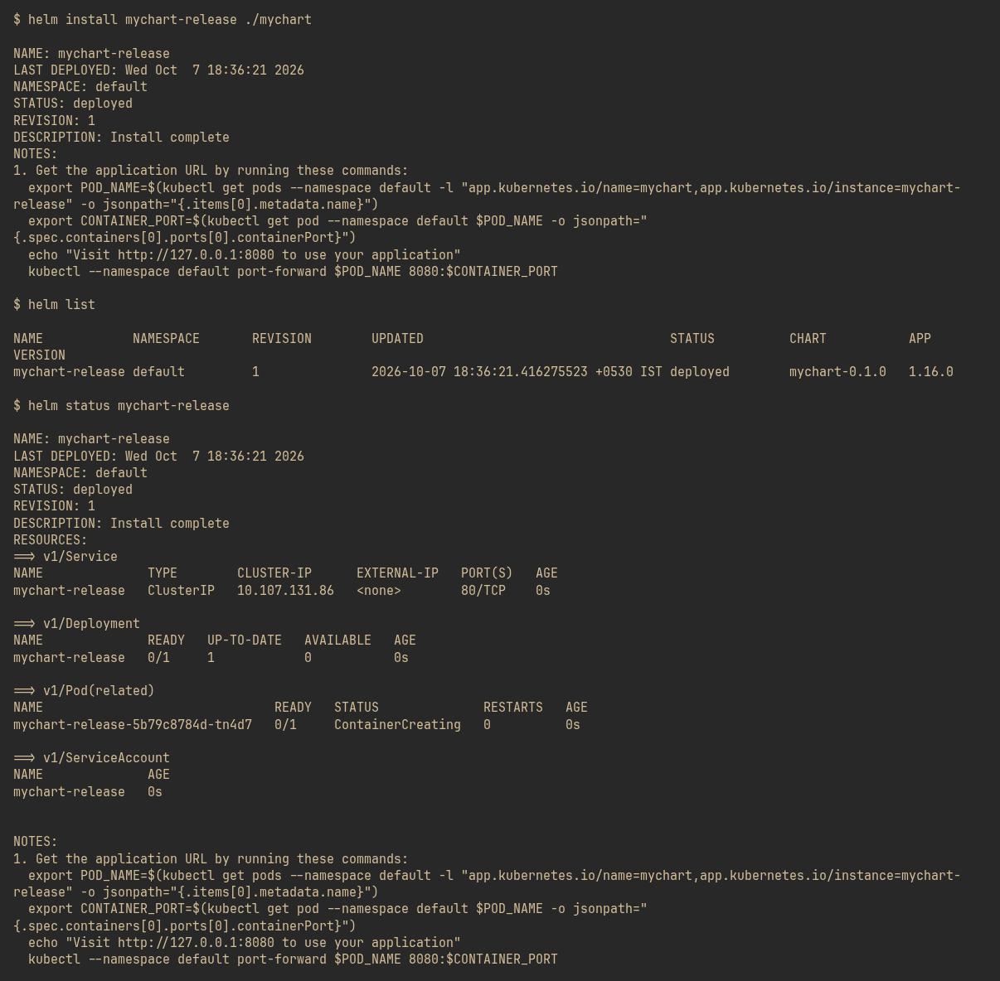

#### 3. helm get values + helm history

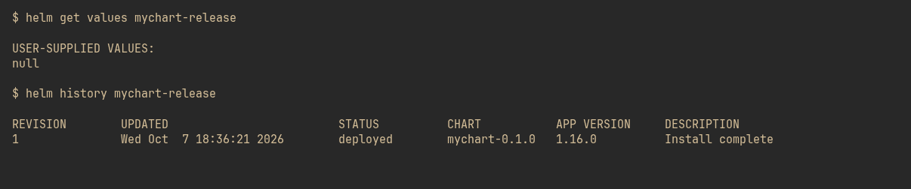

#### 4. helm upgrade

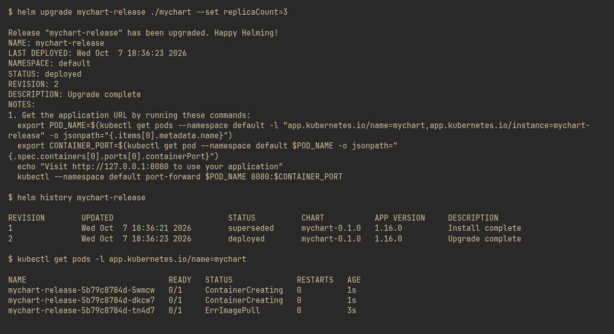

#### 5. helm uninstall

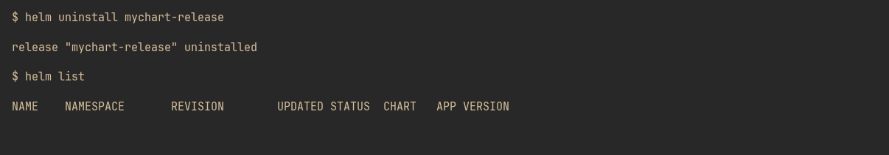

#### 6. helm repo + helm search

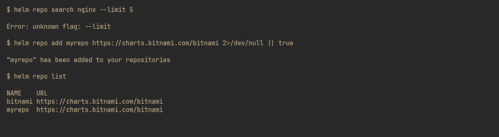

### Task 2 — Helm rollback workflow

#### 1. Install (revision 1)

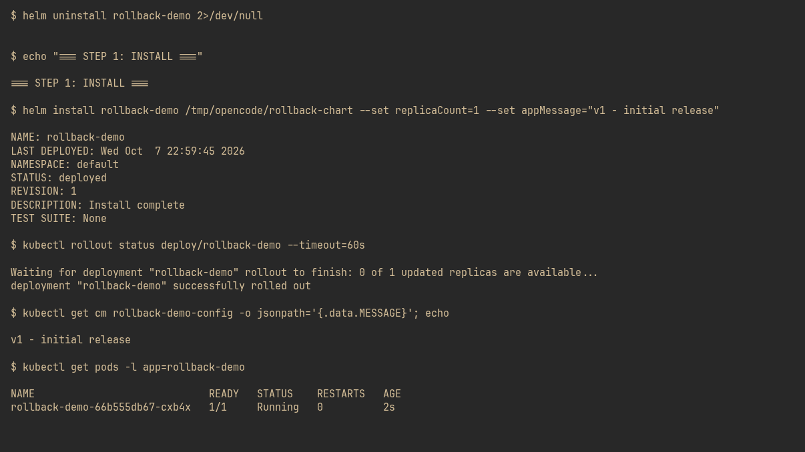

#### 2. Upgrade to v2 — 3 replicas, verify

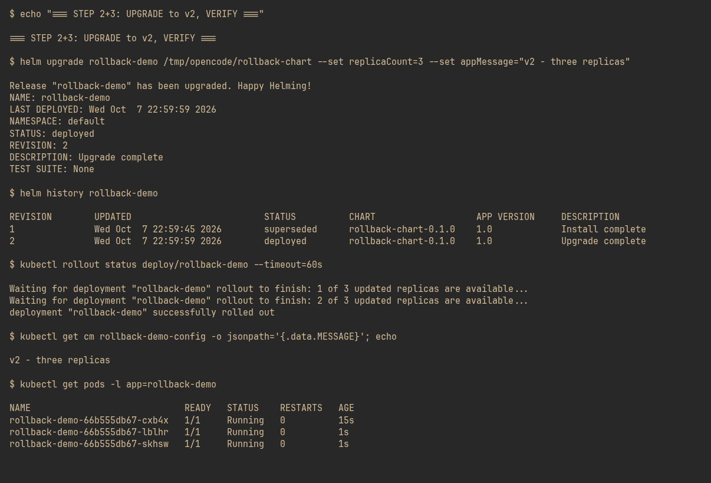

#### 3. Upgrade again to v3 — 1 replica, verify

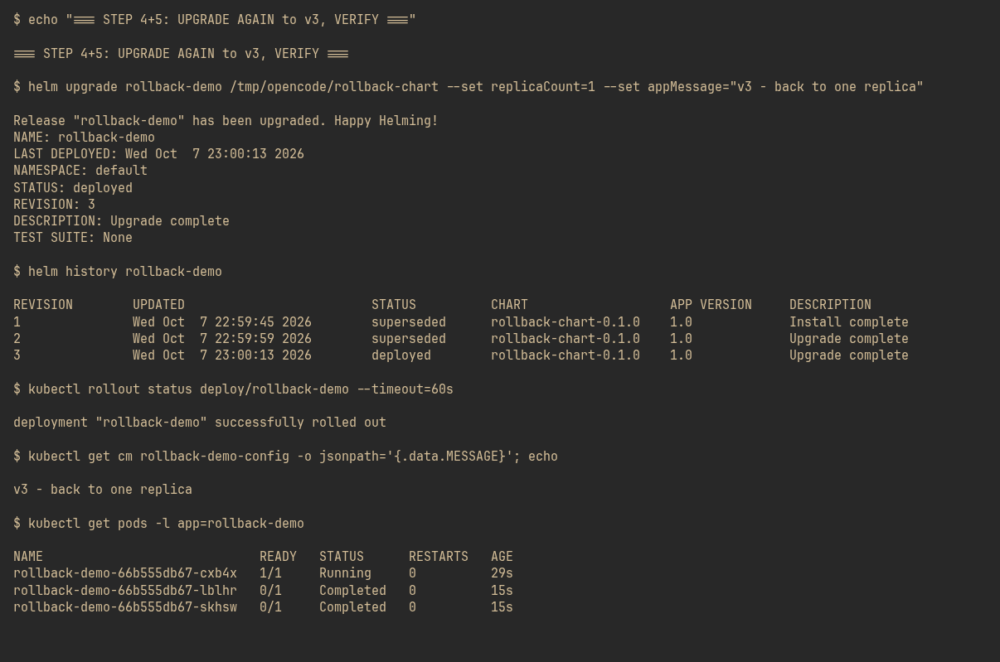

#### 4. Rollback to revision 2, verify

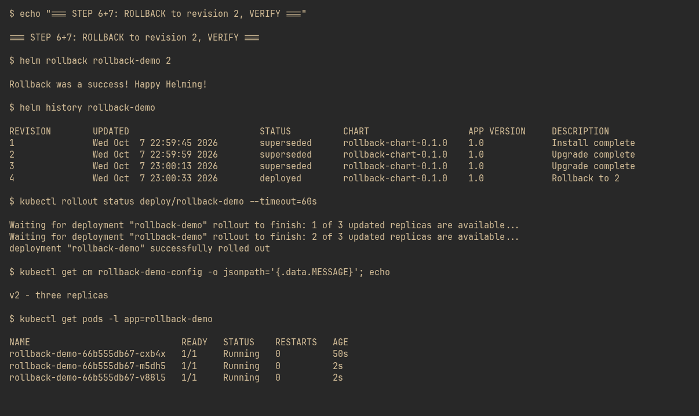

### Task 3 — Mini project (notes-chart)

#### 1. Install

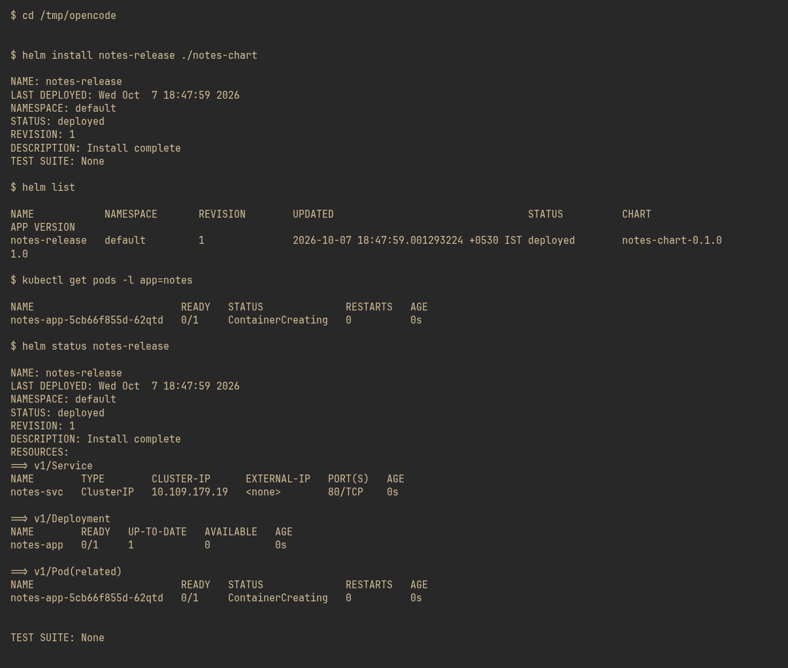

#### 2. Upgrade

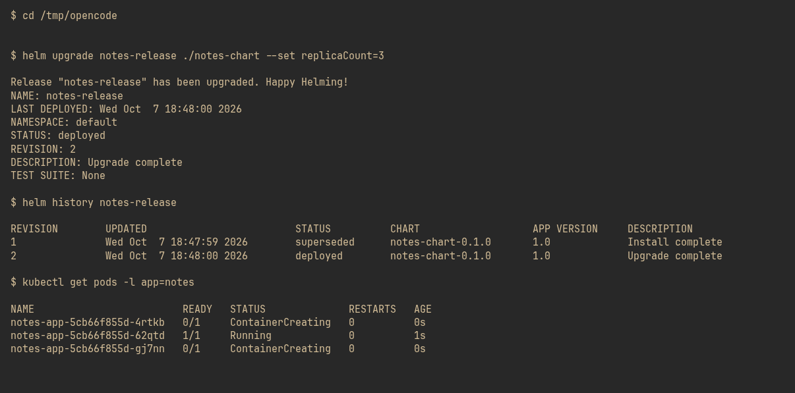

#### 3. Rollback

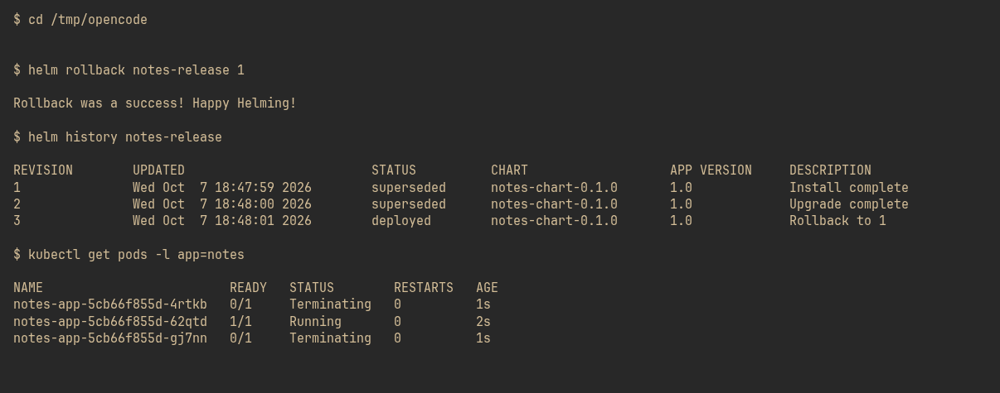
