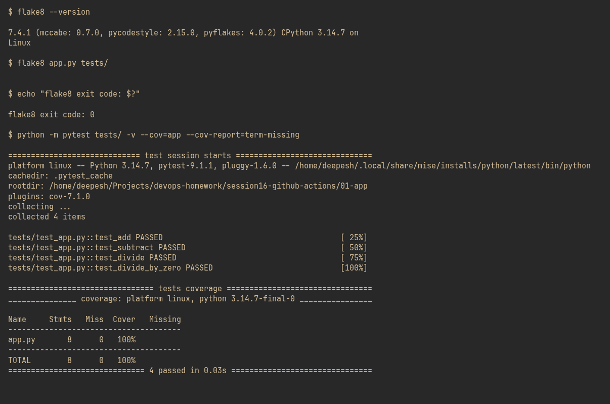
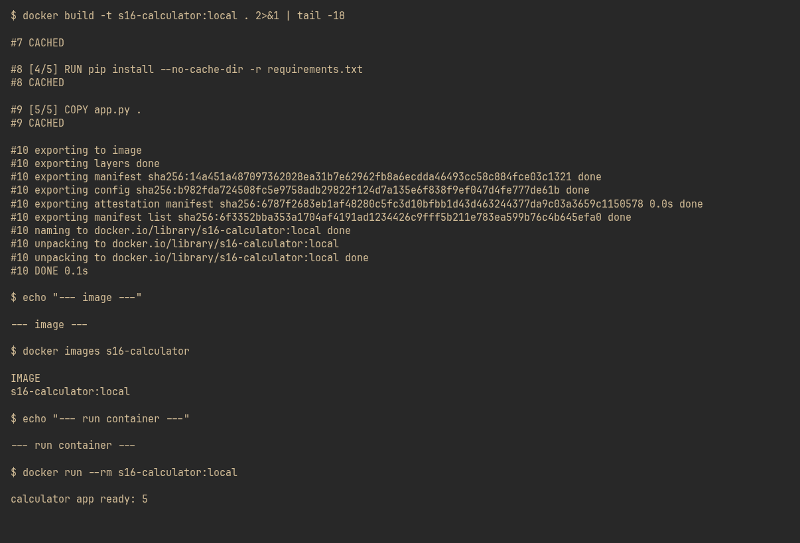
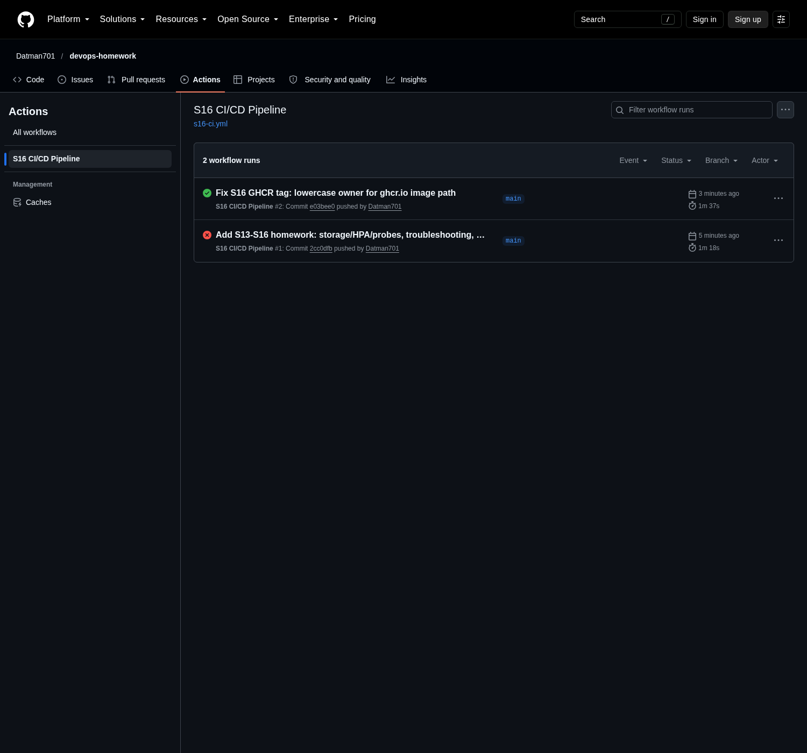
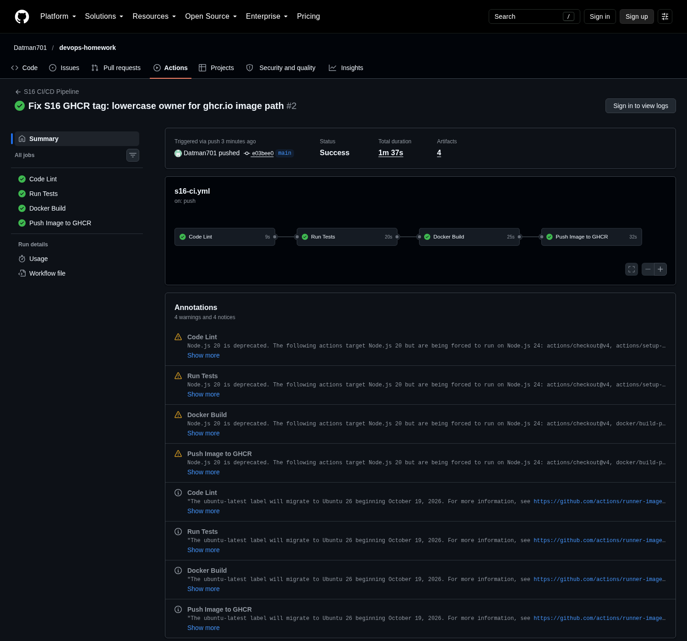
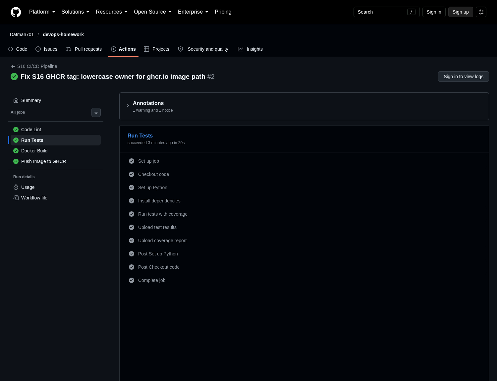
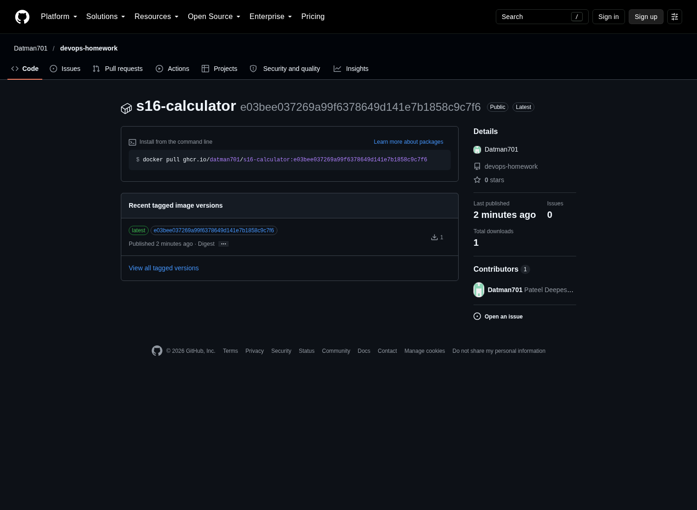

# Session 16: CI/CD & GitHub Actions

Pipeline: `lint` → `test` → `docker-build` → `push` (GHCR).

Workflow definition: `.github/workflows/s16-ci.yml` (mirror copy in `01-app/.github/workflows/ci.yml`).
Application: `01-app/` (calculator + pytest + Dockerfile).
Real run: <https://github.com/Datman701/devops-homework/actions/runs/37660905101>

## Screenshots

### 1. Lint and test locally (flake8 gate + pytest with coverage)

### 2. Docker build and container smoke test

### 3. GitHub Actions — workflow runs list

### 4. Run summary — all four jobs green, job graph with timings

### 5. Run Tests job — every step passed

### 6. Image published to GHCR

