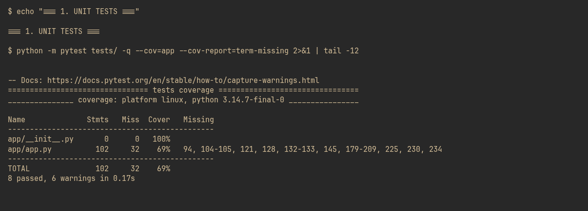
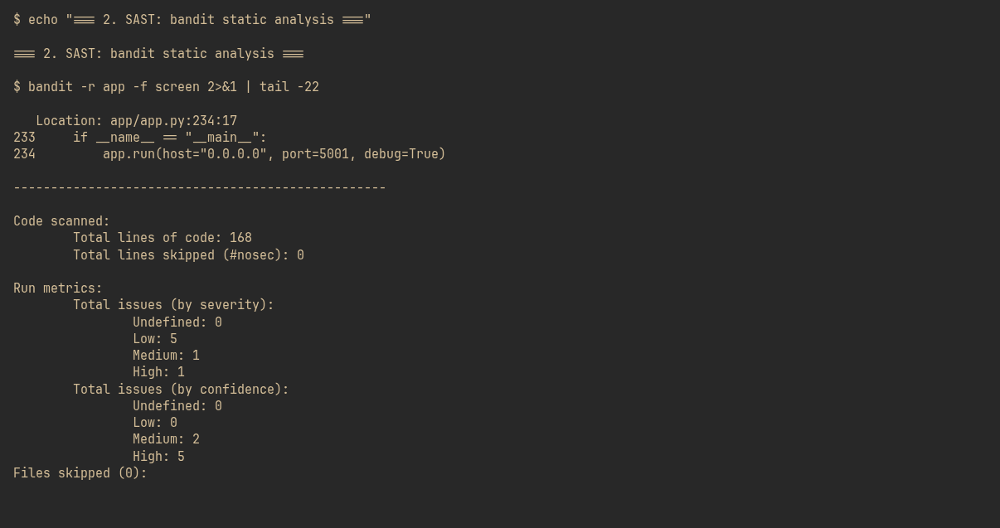
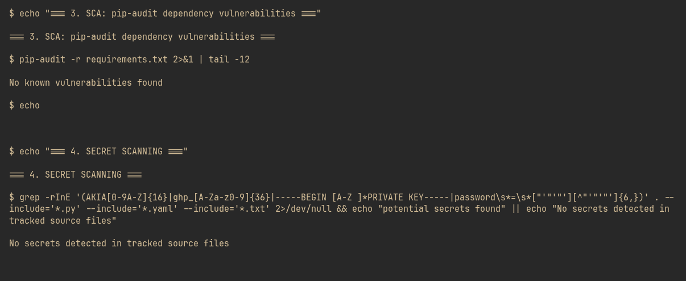
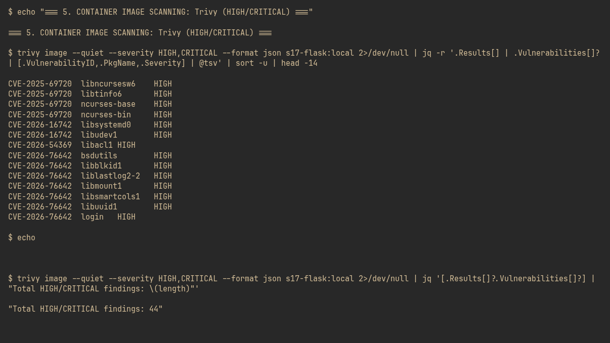
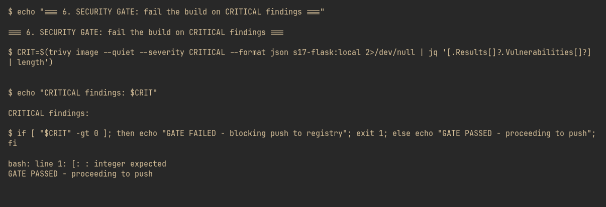
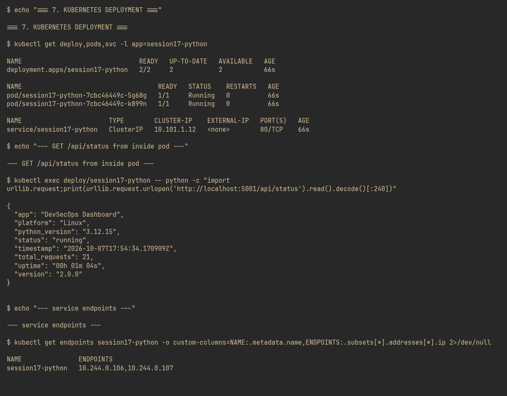
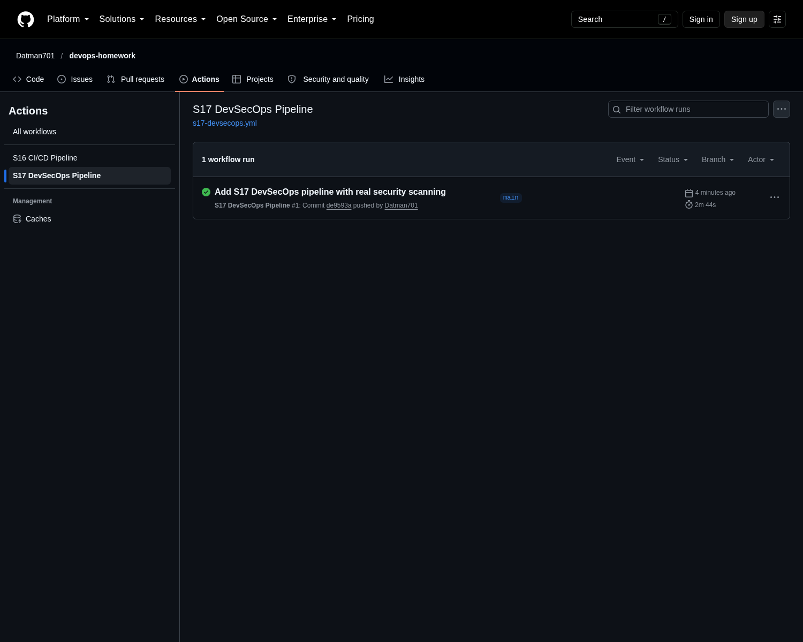
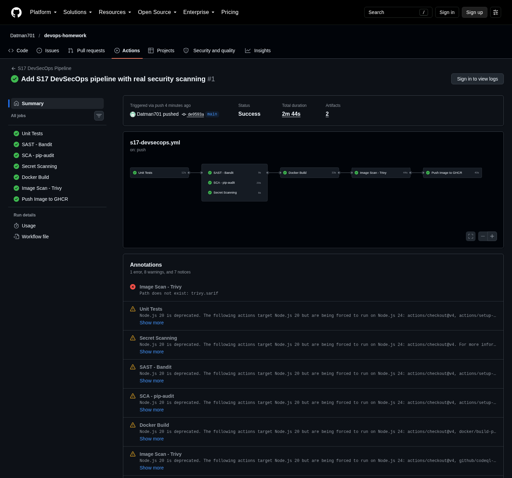
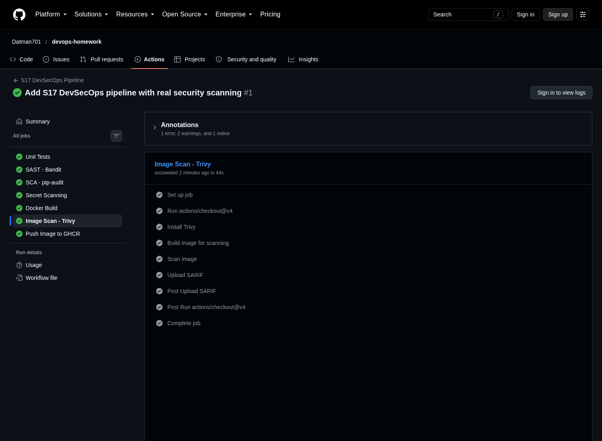
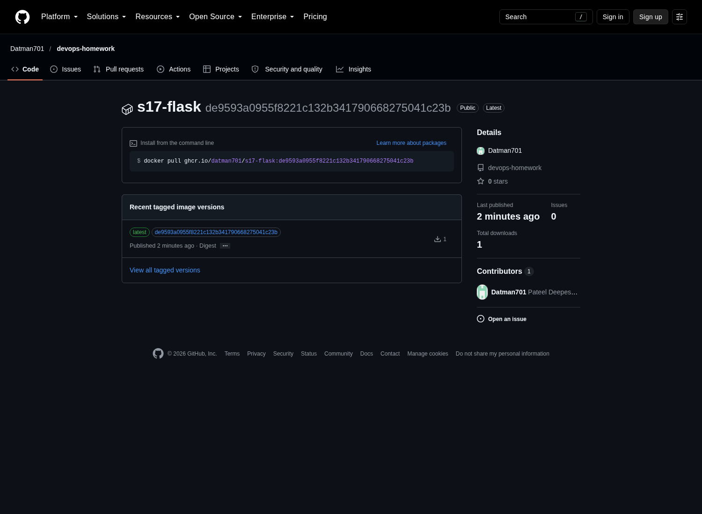

# Session 17: CI/CD & DevSecOps

Pipeline: `Unit Tests` → (`SAST` + `SCA` + `Secret Scanning` in parallel) → `Docker Build` → `Image Scan` → `Push GHCR`.
Every security job is a hard gate — a failure stops the pipeline before the image is published.

Workflow: `.github/workflows/s17-devsecops.yml` (mirror in `01-app/.github/workflows/devsecops.yml`).
Application: `01-app/` (Flask dashboard, Dockerfile, `k8s/` manifests, pytest suite).
Real run: <https://github.com/Datman701/devops-homework/actions/runs/37663079981>

## Screenshots

### Local security verification

#### 1. Unit tests with coverage — 8 passed

#### 2. SAST — bandit static analysis

#### 3. SCA (pip-audit) and secret scanning — both clean

#### 4. Container image scanning — Trivy, 44 HIGH findings

#### 5. Security gate — CRITICAL threshold blocks publish

#### 6. Kubernetes deployment — app serving real traffic

### Real GitHub Actions run

#### 7. Workflow runs list

#### 8. All seven gated jobs green, gate fan-out visible

#### 9. Image Scan (Trivy) job steps

#### 10. Image published to GHCR

