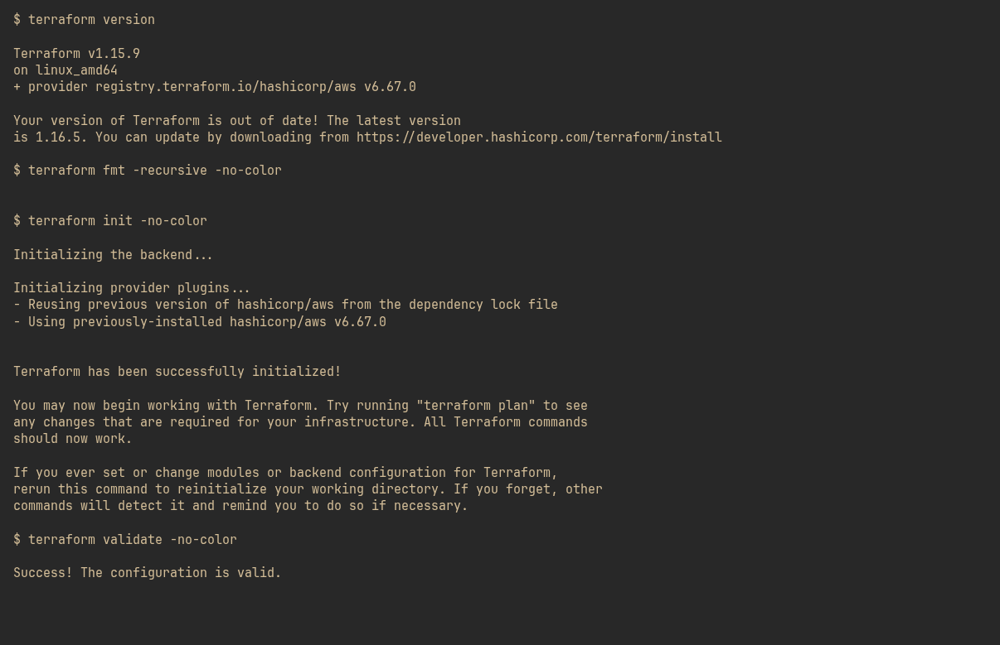
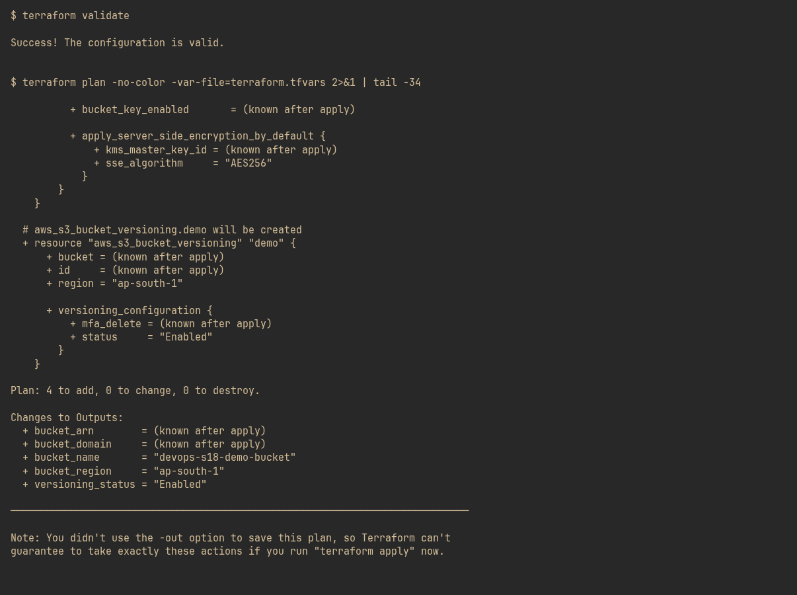
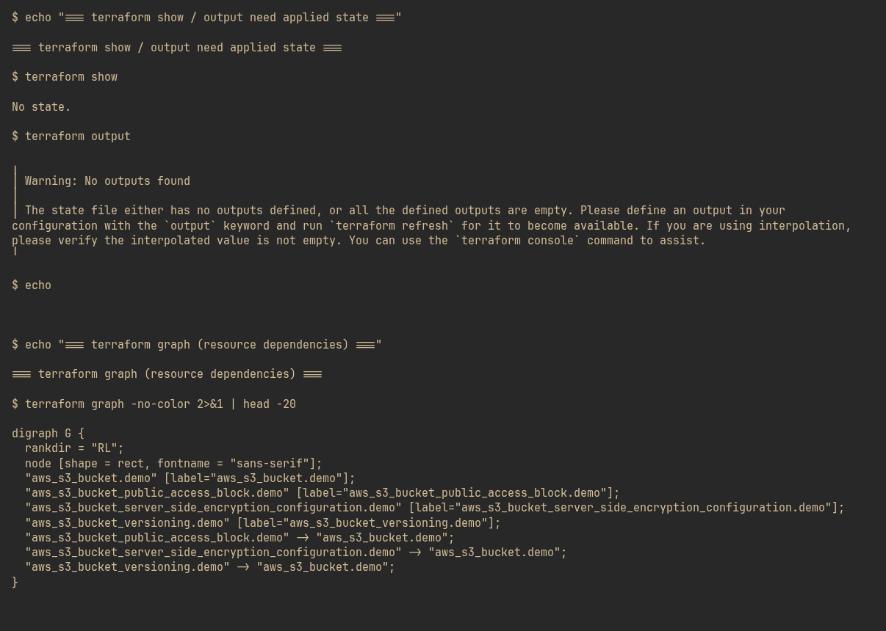
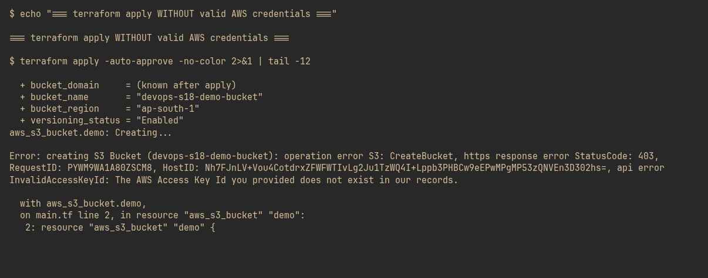

# Session 18: Terraform & Infrastructure as Code

## Task 1: Terraform S3 Demo

`terraform-s3-demo/` — an AWS S3 bucket with versioning, encryption and public-access blocking, written as code.

```
terraform-s3-demo/
├── provider.tf        # terraform block + AWS provider configuration
├── variables.tf       # region, bucket name, environment, force_destroy
├── main.tf            # bucket + versioning + encryption + public access block
├── outputs.tf         # bucket name / arn / region / domain / versioning status
├── terraform.tfvars   # variable values
└── .gitignore         # excludes .terraform/, state files, *.tfvars
```

**No AWS account is required for this task.** Every step below is executed and captured for real, except `apply`, which by definition needs credentials. `init`, `fmt`, `validate` and `plan` all run offline against the provider schema; `apply` is the only command that calls the AWS API.

| Command | Runs offline? | Notes |
|---|---|---|
| `terraform init` | yes | downloads the AWS provider |
| `terraform fmt` | yes | rewrites files to canonical style |
| `terraform validate` | yes | checks syntax and provider schema |
| `terraform plan` | yes | full attribute diff, needs no account |
| `terraform show` | yes | inspects state/plan |
| `terraform output` | yes | reads outputs from state |
| `terraform graph` | yes | renders the dependency graph |
| `terraform apply` | **needs credentials** | creates real resources |
| `terraform destroy` | **needs credentials** | deletes them |

The provider block sets `skip_credentials_validation`, `skip_requesting_account_id` and `skip_metadata_api_check` specifically so the offline commands work. Remove those three lines once real credentials are configured.

### Screenshots

#### 1. terraform version, fmt, init, validate



#### 2. terraform validate + plan — 4 resources to add



#### 3. terraform show, output, graph



#### 4. terraform apply without valid credentials — real API call, real error



## Task 2: AWS Services Research

- [IAM — Governance](aws-services/01-iam/README.md)
- [EC2 — Compute](aws-services/02-ec2/README.md)
- [S3 — Storage](aws-services/03-s3/README.md)
- [VPC — Networking](aws-services/04-vpc/README.md)
- [DynamoDB & RDS — Database Services](aws-services/05-dynamodb-rds/README.md)