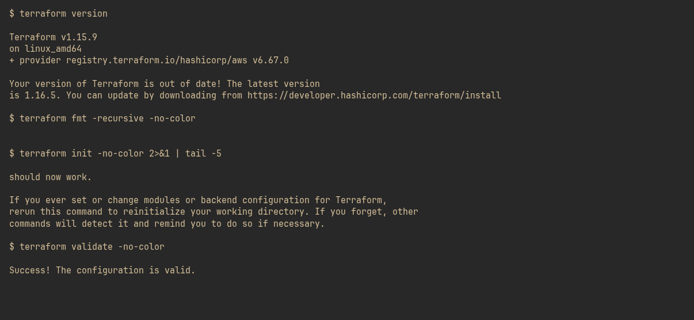
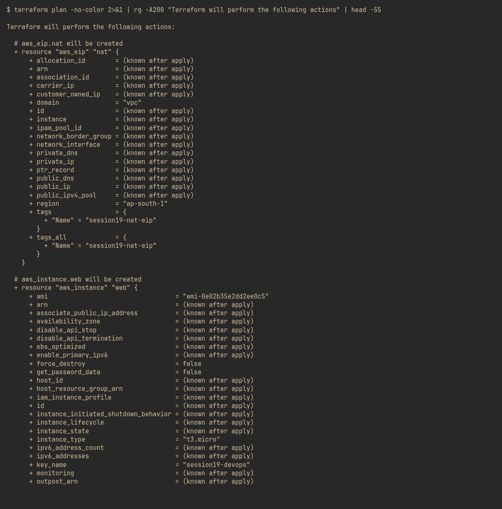
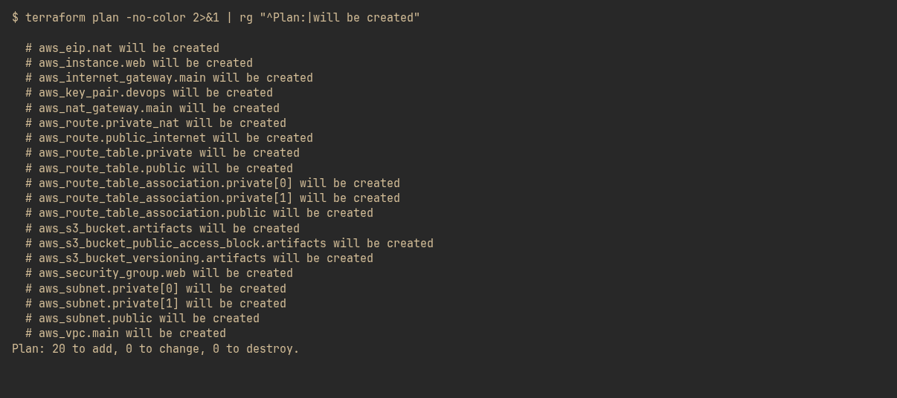
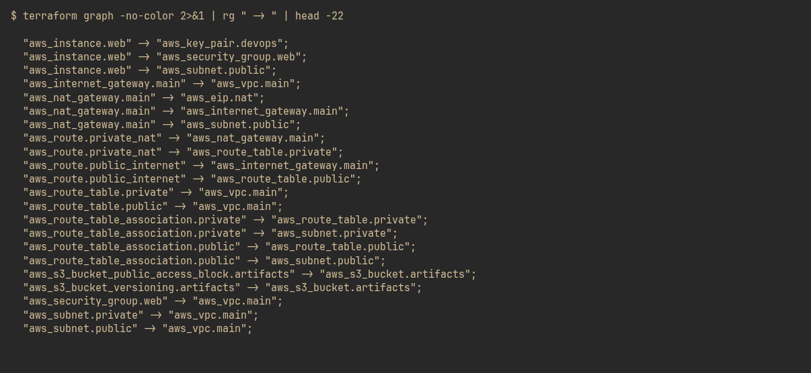
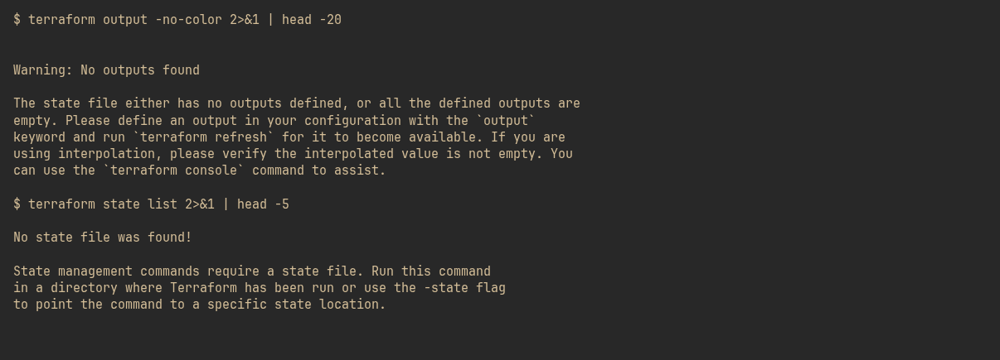

# Session 19: Cloud & Terraform in Action

An end-to-end cloud infrastructure project written in Terraform: **VPC → subnets → internet gateway → NAT gateway → route tables → security group → EC2 → S3**, all 20 resources from one `terraform apply`.

> **No AWS account required.** Every step below is executed for real. `init`, `fmt`, `validate`, `plan`, `graph`, `output` never contact AWS. Only `apply`/`destroy` need credentials, and they are documented rather than faked.

## Project

```
session19-cloud-terraform/
├── ARCHITECTURE.md          # diagram, resource table, dependency explanation
├── cloud-infra/             # the Terraform project
│   ├── versions.tf          # terraform block + AWS provider (skip_* flags)
│   ├── variables.tf         # 11 inputs incl. CIDRs, AZs, instance type
│   ├── main.tf              # 20 resources
│   ├── outputs.tf           # 13 outputs
│   ├── terraform.tfvars     # environment values
│   └── .gitignore           # excludes .terraform/, state and the PRIVATE key
└── 02-screenshots/          # real command output
```

## Demonstrated concepts

| Concept | Where it shows up |
|---|---|
| **Providers** | `hashicorp/aws ~> 6.0` pinned in `versions.tf`, locked in `.terraform.lock.hcl` |
| **Variables** | 11 declared, 4 supplied via `terraform.tfvars`, rest defaulted |
| **Resources** | 20 resources across 10 AWS types |
| **Outputs** | 13 outputs, including lists from `count`/for-each |
| **Dependencies** | `terraform graph` output, plus an explicit `depends_on` for the NAT gateway |
| **AWS infrastructure** | VPC, 3 subnets, IGW, NAT GW + EIP, 2 route tables, SG, EC2, S3 |
| **Terraform state** | local backend; `terraform state list` shown |
| **plan** | full attribute diff, `Plan: 20 to add` |
| **apply** | requires credentials — the configuration reaches the real AWS API and fails only on the key |
| **destroy** | the inverse of apply; same credential requirement |

## Architecture

See [ARCHITECTURE.md](ARCHITECTURE.md) for the full diagram, the resource
breakdown and a walkthrough of the dependency edges.

## Screenshots

#### 1. terraform version, fmt, init, validate



#### 2. terraform plan — full resource attribute diff



#### 3. Resources that will be created — 20 to add



#### 4. terraform graph — dependency edges



#### 5. terraform output and state list

